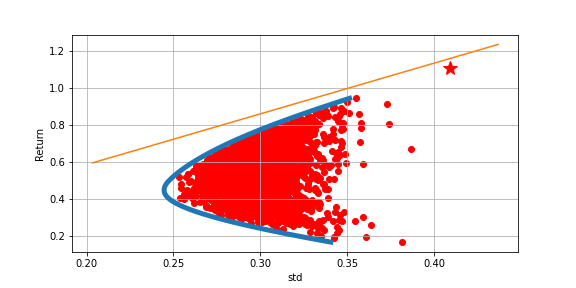

<<<<<<< HEAD
# python马科维茨均值方差模型（解决了资产数量过大无法画出抛物线情况）
## 均值方差模型
马科维茨在《portfolio selection》（1952）提出均值方差模型，在给定期望收益下风险最小，或者给定风险下期望收益最大，其本质是数学中最优化问题。

实际操作中，利用N个资产的历史数据计算投资组合的收益和波动率，求解最优化问题做出有效前沿，其中夏普比率最大的组合是市场组合。

均值方差模型理论上会得到抛物线形状的散点图。但是在实际操作中，当资产数量N（5左右）不大时候，利用随机初始化权重方法可以画出较好的抛物线，但是当资产数量N太大时候（大于10）就很难通过随机初始化权重方法画出抛物线形状的散点图。

本项目利用A股历史数据，利用python实现均值方差模型画出有效前沿和CML（资本市场线），并且解决资产数量过大无法画出抛物线散点图的情况。

## python库
- numpy
- matplotlib
- scipy
- itertools
## 数据来源
- wind
## 代码和数据
- 详见主页
## 结果展示

=======
# mean_variance_model
马科维茨均值方差模型；有效前沿；python解决了资产数量过大无法画出抛物线情况.
>>>>>>> 079b4ad1056309e5735e8f1563412ba73552e6a3
